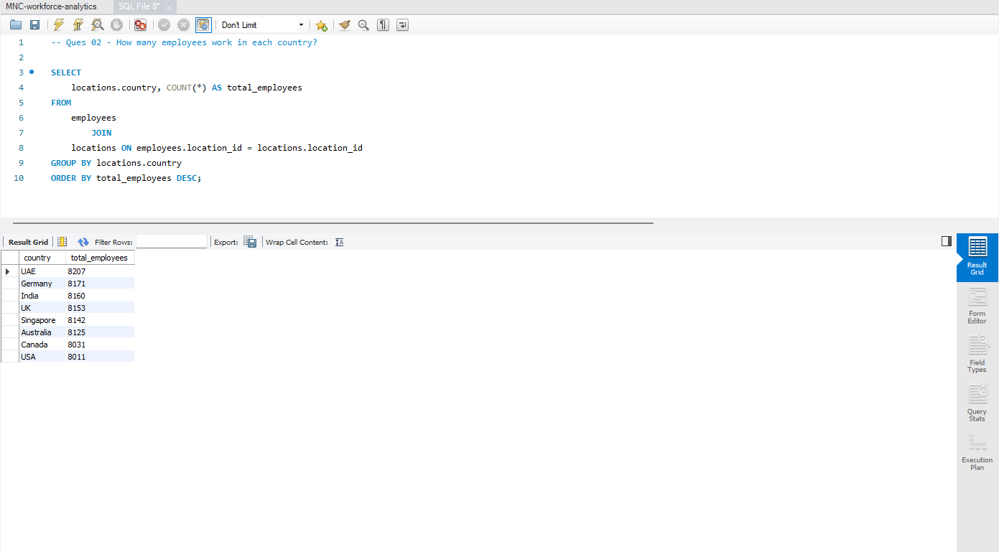
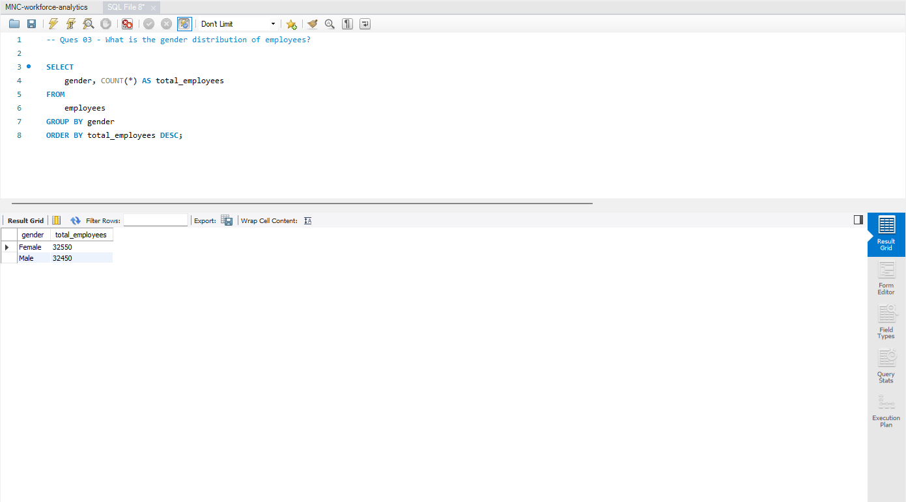
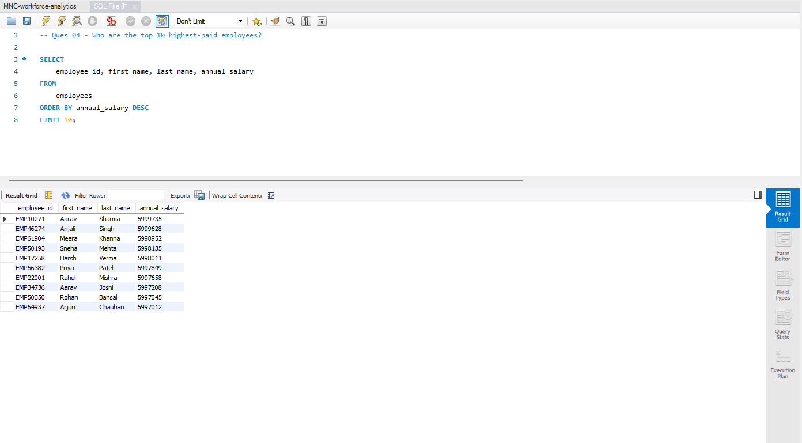
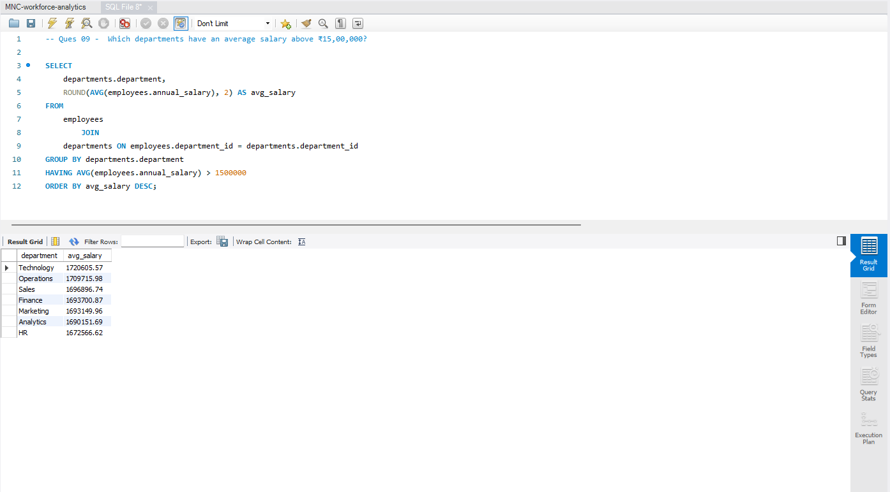
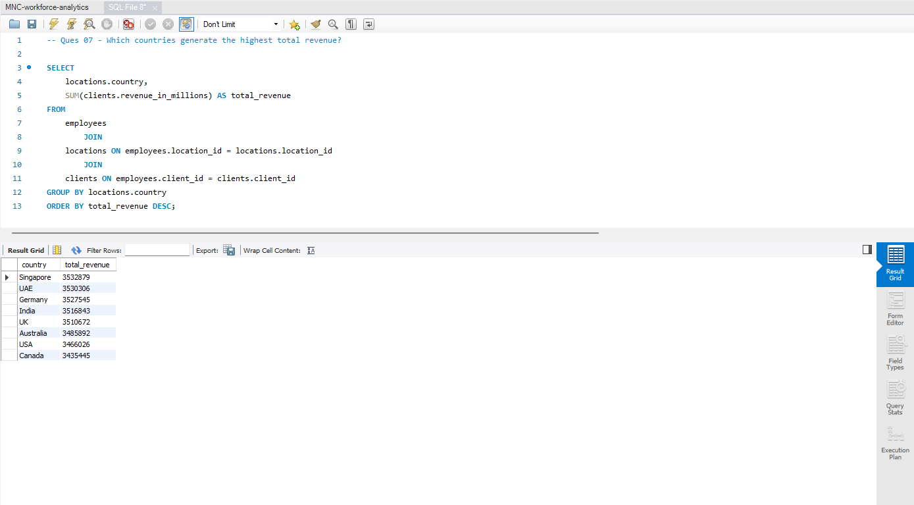
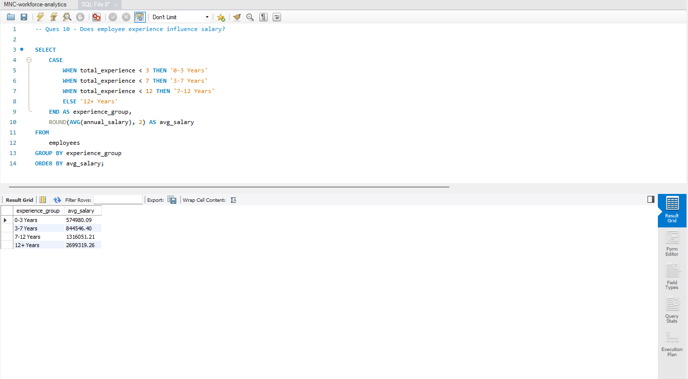

# Employee Performance & Revenue Analytics Using MySQL

## Project Overview

This project analyzes a synthetic dataset of **65,000 employees** working across multiple countries, departments, and client accounts. The objective is to leverage **MySQL** to answer real-world business questions related to workforce distribution, employee compensation, performance evaluation, and revenue generation.

---

## Business Problem

Large organizations often struggle to answer questions such as:

- How is the workforce distributed across countries?
- Which departments are the most expensive?
- Does employee experience influence salary?
- Which clients contribute the most revenue?
- Which countries generate the highest revenue?
- Who are the company's highest-paid employees?

This project addresses these questions through structured SQL analysis.

---

## Dataset Overview

| Metric | Value |
|--------|--------|
| Total Employees | 65,000 |
| Database Tables | 4 |
| Countries | 8 |
| Business Domains | 8 |
| Departments | 56 |
| Revenue Information | Included |

---

## Database Schema

```text
employees
│
├── department_id ──► departments
├── location_id ────► locations
└── client_id ──────► clients
```

---

## Tables Used

### Employees
- Employee ID
- First Name
- Last Name
- Gender
- Joining Date
- Total Experience
- Annual Salary
- Performance Rating
- Department ID
- Location ID
- Client ID

### Departments
- Department ID
- Department Name
- Business Domain

### Locations
- Location ID
- Country
- City

### Clients
- Client ID
- Client Account Name
- Revenue in Millions

---

## Tools Used

- MySQL
- MySQL Workbench
- GitHub

---

## SQL Concepts Demonstrated

### Querying & Filtering
- SELECT
- WHERE
- ORDER BY
- LIMIT

### Aggregate Functions
- COUNT()
- SUM()
- AVG()

### Grouping & Filtering
- GROUP BY
- HAVING

### Joins
- INNER JOIN
- Multi-table JOINs

### Advanced SQL
- CASE Statements
- Subqueries
- Common Table Expressions (CTEs)
- Window Functions
  - ROW_NUMBER()
  - RANK()
  - DENSE_RANK()

---

# Business Questions Answered

### Beginner Analysis
1. How many employees does the company have?
2. How many employees work in each country?
3. What is the gender distribution of employees?
4. Who are the top 10 highest-paid employees?
5. How many unique clients does the company serve?

### Intermediate Analysis
6. Which departments have the highest average salary?
7. Which countries generate the highest total revenue?
8. Which business domains employ the most people?
9. Which departments have an average performance rating above 3.5?
10. Does employee experience influence salary?

### Advanced Analysis
11. Find the top 5 highest-paid employees in each country.
12. Find the highest revenue-generating employee in every department.
13. Rank clients by total revenue contribution.
14. Find employees whose salary is above their department's average salary.
15. Find the top-performing employee in every domain.

---

# Key Findings & Business Insights

## 1. Employee Distribution Across Countries



### Insight
Employee count is relatively balanced across all countries. No single country dominates the workforce.

### Recommendation
Compare workforce size with revenue and performance metrics to identify high-performing regions and optimize resource allocation.

---

## 2. Gender Distribution of Employees



### Insight
The workforce composition provides visibility into diversity and hiring trends.

### Recommendation
Monitor diversity metrics and ensure balanced workforce representation across business units.

---

## 3. Top 10 Highest-Paid Employees



### Insight
A small group of employees receives significantly higher compensation than the rest of the workforce.

### Recommendation
Review compensation strategies and retention plans for highly compensated and business-critical talent.

---

## 4. Average Salary by Department



### Insight
Certain departments command considerably higher average salaries than others.

### Recommendation
Evaluate whether compensation levels align with departmental performance and business outcomes.

---

## 5. Revenue Contribution by Country



### Insight
Revenue generation varies significantly across countries, with a few regions contributing disproportionately to total revenue.

### Recommendation
Prioritize investments and workforce planning in high-performing regions while identifying opportunities for growth in lower-performing markets.

---

## 6. Relationship Between Experience and Salary



### Insight
Average salary generally increases with employee experience, indicating a positive relationship between experience and compensation.

### Recommendation
Develop transparent compensation frameworks and clearly defined career progression paths to improve employee retention and motivation.

---

# Project Outcomes

This project demonstrates the ability to:

- Design and work with relational databases
- Solve business problems using SQL
- Perform workforce and revenue analytics
- Write optimized analytical queries
- Apply advanced SQL concepts
- Translate raw data into actionable business insights
- Communicate findings effectively through structured reporting

---

# Repository Structure

```text
Employee-Performance-Revenue-Analytics-SQL
│
├── README.md
│
├── Dataset
│   ├── employees.csv
│   ├── departments.csv
│   ├── locations.csv
│   └── clients.csv
│
├── SQL Scripts
│   ├── 01_database_setup.sql
│   ├── 02_business_questions.sql
│   └── 03_advanced_queries.sql
│
└── Screenshots
    ├── employee-distribution-country-wise.png
    ├── gender-distribution.png
    ├── top10-highest-paid-employees.png
    ├── average-salary-department-wise.png
    ├── highest-total-revenue-country-wise.png
    └── experience-vs-salary.png
```

---

# Skills Demonstrated

`SQL` `MySQL` `Data Analysis` `Business Analysis` `Joins`
`Aggregate Functions` `Subqueries` `CTEs`
`Window Functions` `Analytical Thinking`
`Business Intelligence`

---

# Author

**Himanshu Rajput**

Business Analyst | MBA Candidate at Symbiosis International University
